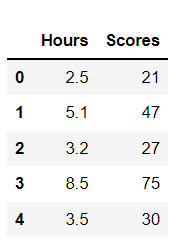
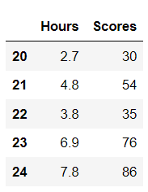
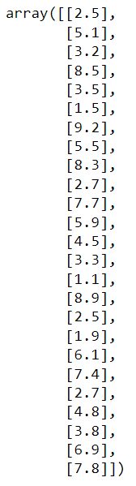
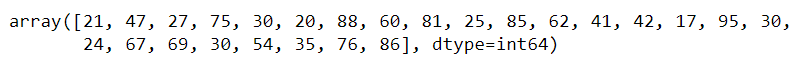
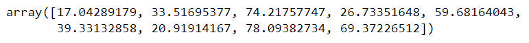
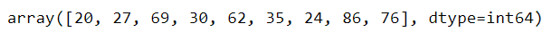
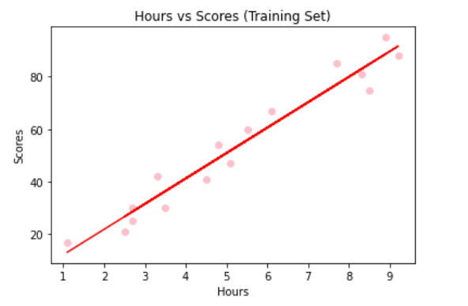

# Implementation-of-Simple-Linear-Regression-Model-for-Predicting-the-Marks-Scored

## AIM:
To write a program to implement the simple linear regression model for predicting the marks scored.

## Equipments Required:
1. Hardware – PCs
2. Anaconda – Python 3.7 Installation / Moodle-Code Runner

## Algorithm
1. Import the standard Libraries.
2. Set variables for assigning dataset values.
3. Import linear regression from sklearn.
4. Assign the points for representing in the graph
5. Predict the regression for marks by using the representation of the graph.
6. Compare the graphs and hence we obtained the linear regression for the given datas.

## Program:
```
/*
Program to implement the simple linear regression model for predicting the marks scored.
Developed by: Kaushika.A
RegisterNumber: 212221230048
*/
import pandas as pd
import numpy as np
import matplotlib.pyplot as plt
df=pd.read_csv('student_scores.csv')
#displaying the content in datafile 
df.head()

df.tail()

# Segregating data to variables
X = df.iloc[:,:-1].values
X

Y=df.iloc[:,1].values
Y

#splitting train and test data
from sklearn.model_selection import train_test_split
X_train,X_test,Y_train,Y_test=train_test_split(X,Y,test_size=1/3,random_state=0)
from sklearn.linear_model import LinearRegression
regressor=LinearRegression()
regressor.fit(X_train,Y_train)
Y_pred=regressor.predict(X_test)
#displaying predicted values
Y_pred
#displaying actual values
Y_test

#graph plot for training data
plt.scatter(X_train,Y_train,color="pink")
plt.plot(X_train,regressor.predict(X_train),color="red")
plt.title("Hours vs Scores (Training Set)")
plt.xlabel("Hours")
plt.ylabel("Scores")
plt.show()

#graph plot for test data
plt.scatter(X_test,Y_test,color="orange")
plt.plot(X_train,regressor.predict(X_train),color="yellow") 
plt.title("Hours vs Scores (Test Set)")
plt.xlabel("Hours")
plt.ylabel("Scores")
plt.show()
```

## Output:
## Contents in the data file (head, tail):


## X and Y datasets from original dataset:


## Predicted and Test values of Y:


## Graph for Training Data:

## Graph for Test Data:


## Result:
Thus the program to implement the simple linear regression model for predicting the marks scored is written and verified using python programming.
